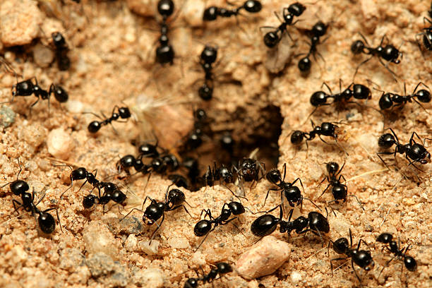

# 2TL1-2-Fourmis

## Ant colony simulator in python

### This python program simulate a colony that grow, react to threats, looks for food and evolve.

**_Hausman Pierre-Alexandre_**\
**_Hoedenaeken Nicolas_**\
**_Gay Edward_**
