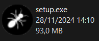
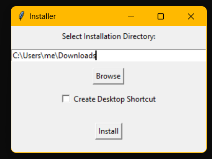
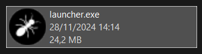

# 2TL1-2-Fourmis

## Ant colony simulator in python

### This python program simulate a colony that grow, react to threats, looks for food and evolve.

**_Hausman Pierre-Alexandre: linadu2_**\
**_Hoedenaeken Nicolas: nicoHoed_**\
**_Gay Edward: maxeouw_**

---

# How to use

Once you have download the setup file, you should see a `setup.exe` file in your file explorer.

When you open it, you can choose in wich folder the launcher will be place.

> Check if you want a desktop shorcut.

Then, the `launcher.exe` file will be created in the specified folder

